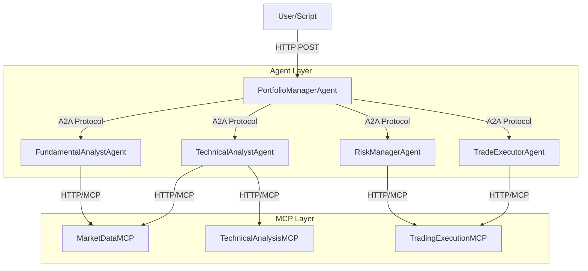

# Design Document

## Overview

The MCP A2A Trading System is a sophisticated multi-agent financial analysis and trading platform built on a microservices architecture. The system combines Model Context Protocol (MCP) servers for standardized data access with autonomous agents that communicate via Google's Agent-to-Agent (A2A) protocol using JSON-RPC 2.0 over HTTP.

The architecture follows a supervisor/orchestrator pattern where a PortfolioManagerAgent coordinates specialized analyst agents to perform comprehensive market analysis and execute simulated trades. All services are built using FastAPI for high performance and automatic API documentation.

## Architecture

### High-Level Architecture



### Service Distribution

Each component runs as an independent FastAPI application on dedicated ports:

- **PortfolioManagerAgent**: Port 8000
- **FundamentalAnalystAgent**: Port 8001
- **TechnicalAnalystAgent**: Port 8002
- **RiskManagerAgent**: Port 8003
- **TradeExecutorAgent**: Port 8004
- **MarketDataMCP**: Port 9000
- **TechnicalAnalysisMCP**: Port 9001
- **TradingExecutionMCP**: Port 9002

### Communication Protocols

1. **External Interface**: RESTful HTTP API for user interaction
2. **Inter-Agent Communication**: A2A protocol (JSON-RPC 2.0 over HTTP)
3. **Agent-to-MCP Communication**: Standard HTTP requests to MCP endpoints

## Components and Interfaces

### MCP Servers

#### MarketDataMCP Server
**Purpose**: Provides simulated financial market data
**Port**: 9000
**Endpoint**: `/mcp`

**API Functions**:
```python
# Stock price data with OHLCV format
get_stock_price(ticker: str) -> dict:
    return {
        "ticker": str,
        "data": [
            {
                "date": "YYYY-MM-DD",
                "open": float,
                "high": float,
                "low": float,
                "close": float,
                "volume": int
            }
        ]
    }

# Market news and sentiment
get_market_news(ticker: str) -> list[dict]:
    return [
        {
            "headline": str,
            "summary": str,
            "sentiment": "positive|negative|neutral",
            "date": "YYYY-MM-DD",
            "source": str
        }
    ]

# Financial statements
get_financial_statements(ticker: str) -> dict:
    return {
        "ticker": str,
        "revenue": float,
        "net_income": float,
        "total_assets": float,
        "total_debt": float,
        "cash": float,
        "period": "Q1 2024"
    }
```

#### TechnicalAnalysisMCP Server
**Purpose**: Calculates technical indicators
**Port**: 9001
**Endpoint**: `/mcp`

**API Functions**:
```python
calculate_indicator(price_data: list, indicator_name: str, params: dict) -> dict:
    # Supported indicators: RSI, SMA, EMA, MACD, Bollinger Bands
    return {
        "indicator": str,
        "values": [float],
        "signal": "BUY|SELL|HOLD",
        "confidence": float  # 0.0 to 1.0
    }
```

#### TradingExecutionMCP Server
**Purpose**: Simulates brokerage connection for paper trading
**Port**: 9002
**Endpoint**: `/mcp`

**API Functions**:
```python
execute_mock_trade(ticker: str, action: str, quantity: int, trade_type: str) -> dict:
    return {
        "trade_id": str,
        "ticker": str,
        "action": "BUY|SELL",
        "quantity": int,
        "price": float,
        "total_value": float,
        "status": "EXECUTED|FAILED",
        "timestamp": str
    }

get_portfolio_status() -> dict:
    return {
        "cash_balance": float,
        "positions": [
            {
                "ticker": str,
                "quantity": int,
                "avg_cost": float,
                "current_value": float
            }
        ],
        "total_value": float
    }
```

### Agent System

#### PortfolioManagerAgent
**Role**: System orchestrator and strategic decision-maker
**Port**: 8000

**Endpoints**:
- `POST /start_strategy`: Receives investment goals from external users
- `POST /a2a`: Handles A2A protocol communications

**Workflow Logic**:
1. Parse incoming investment strategy
2. Delegate fundamental analysis task to FundamentalAnalystAgent
3. Delegate technical analysis task to TechnicalAnalystAgent
4. Synthesize analysis results into trade proposal
5. Submit proposal to RiskManagerAgent for approval
6. If approved, instruct TradeExecutorAgent to execute
7. Log complete workflow results

#### FundamentalAnalystAgent
**Role**: Company financial health assessment
**Port**: 8001

**Endpoints**:
- `POST /a2a`: Receives analysis requests via A2A protocol

**Analysis Logic**:
1. Query MarketDataMCP for financial statements and news
2. Calculate fundamental metrics (P/E ratios, debt-to-equity, growth rates)
3. Analyze news sentiment
4. Rank companies based on fundamental strength
5. Return prioritized recommendations

#### TechnicalAnalystAgent
**Role**: Price action and market timing analysis
**Port**: 8002

**Endpoints**:
- `POST /a2a`: Receives ticker analysis requests via A2A protocol

**Analysis Logic**:
1. Fetch historical price data from MarketDataMCP
2. Calculate multiple technical indicators via TechnicalAnalysisMCP
3. Apply signal generation rules (moving average crossovers, RSI levels)
4. Generate confidence-weighted trading signals
5. Return clear BUY/SELL/HOLD recommendation

#### RiskManagerAgent
**Role**: Trade approval and portfolio risk management
**Port**: 8003

**Endpoints**:
- `POST /a2a`: Receives trade proposals for risk evaluation

**Risk Rules**:
1. Maximum position size: 10% of portfolio value
2. Maximum sector concentration: 30% of portfolio
3. Minimum cash reserve: 20% of portfolio value
4. Maximum single trade value: $10,000 (simulated)

#### TradeExecutorAgent
**Role**: Trade execution and confirmation
**Port**: 8004

**Endpoints**:
- `POST /a2a`: Receives approved trade orders

**Execution Logic**:
1. Validate trade parameters
2. Call TradingExecutionMCP to execute trade
3. Handle execution confirmations and errors
4. Report results back to PortfolioManagerAgent

## Data Models

### A2A Protocol Message Format
```python
class A2ARequest:
    jsonrpc: str = "2.0"
    method: str
    params: dict
    id: str

class A2AResponse:
    jsonrpc: str = "2.0"
    result: dict = None
    error: dict = None
    id: str
```

### Investment Strategy Model
```python
class InvestmentStrategy:
    goal: str
    sector_preference: str = None
    risk_tolerance: str = "medium"  # low, medium, high
    max_investment: float = 50000.0
    time_horizon: str = "short"  # short, medium, long
```

### Analysis Result Models
```python
class FundamentalAnalysis:
    ticker: str
    score: float  # 0-100
    strengths: list[str]
    weaknesses: list[str]
    recommendation: str

class TechnicalAnalysis:
    ticker: str
    signal: str  # BUY, SELL, HOLD
    confidence: float  # 0.0-1.0
    indicators: dict
    entry_price: float
    stop_loss: float
    target_price: float

class TradeProposal:
    ticker: str
    action: str
    quantity: int
    rationale: str
    expected_return: float
    risk_level: str
```

### Portfolio State Model
```python
class Portfolio:
    cash_balance: float = 100000.0  # Starting capital
    positions: dict[str, Position] = {}
    trade_history: list[Trade] = []
    
class Position:
    ticker: str
    quantity: int
    avg_cost: float
    current_value: float
    
class Trade:
    trade_id: str
    ticker: str
    action: str
    quantity: int
    price: float
    timestamp: datetime
    status: str
```

## Error Handling

### MCP Server Error Handling
- **Connection Errors**: Retry logic with exponential backoff
- **Data Validation**: Input sanitization and type checking
- **Service Unavailable**: Graceful degradation with cached data

### Agent Error Handling
- **A2A Communication Failures**: Timeout handling and retry mechanisms
- **Analysis Errors**: Fallback to conservative recommendations
- **Trade Execution Failures**: Error reporting and rollback procedures

### Error Response Format
```python
class ErrorResponse:
    error_code: str
    error_message: str
    error_details: dict = None
    timestamp: str
    service: str
```

## Testing Strategy

### Unit Testing
- **MCP Servers**: Test all API endpoints with various input scenarios
- **Agents**: Test individual agent logic and decision-making algorithms
- **Data Models**: Validate serialization/deserialization and business rules

### Integration Testing
- **A2A Communication**: Test inter-agent message passing and protocol compliance
- **MCP Integration**: Verify agent-to-MCP server communication
- **End-to-End Workflows**: Test complete trading scenarios from strategy to execution

### Simulation Testing
- **Market Scenarios**: Test system behavior under various market conditions
- **Risk Scenarios**: Validate risk management rules under stress conditions
- **Performance Testing**: Measure system throughput and response times

### Test Data Management
- **Simulated Market Data**: Realistic price movements and financial statements
- **News Data**: Varied sentiment scenarios for fundamental analysis
- **Portfolio States**: Different starting conditions and position scenarios

## Security Considerations

### Input Validation
- Sanitize all external inputs to prevent injection attacks
- Validate ticker symbols against allowed lists
- Limit trade quantities and values to reasonable ranges

### Service Communication
- Use HTTPS for all inter-service communication in production
- Implement API key authentication for MCP servers
- Rate limiting to prevent abuse

### Data Protection
- No real financial data or API keys in the simulation
- Secure logging practices (no sensitive data in logs)
- Proper error handling to prevent information leakage

## Performance Optimization

### Caching Strategy
- Cache market data responses for short periods (1-5 minutes)
- Cache technical indicator calculations
- Implement LRU cache for frequently accessed data

### Asynchronous Processing
- Use FastAPI's async capabilities for I/O operations
- Implement concurrent analysis requests where possible
- Non-blocking A2A communication patterns

### Resource Management
- Connection pooling for HTTP clients
- Memory-efficient data structures for large datasets
- Graceful shutdown procedures for all services

## Deployment Architecture

### Development Environment
- All services run locally on different ports
- Shared configuration file for service discovery
- Docker Compose setup for easy orchestration

### Service Discovery
```python
# config.py
SERVICE_URLS = {
    "portfolio_manager": "http://localhost:8000",
    "fundamental_analyst": "http://localhost:8001",
    "technical_analyst": "http://localhost:8002",
    "risk_manager": "http://localhost:8003",
    "trade_executor": "http://localhost:8004",
    "market_data_mcp": "http://localhost:9000",
    "technical_analysis_mcp": "http://localhost:9001",
    "trading_execution_mcp": "http://localhost:9002"
}
```

### Monitoring and Observability
- Structured logging with correlation IDs
- Health check endpoints for all services
- Metrics collection for performance monitoring
- Request/response logging for audit trails